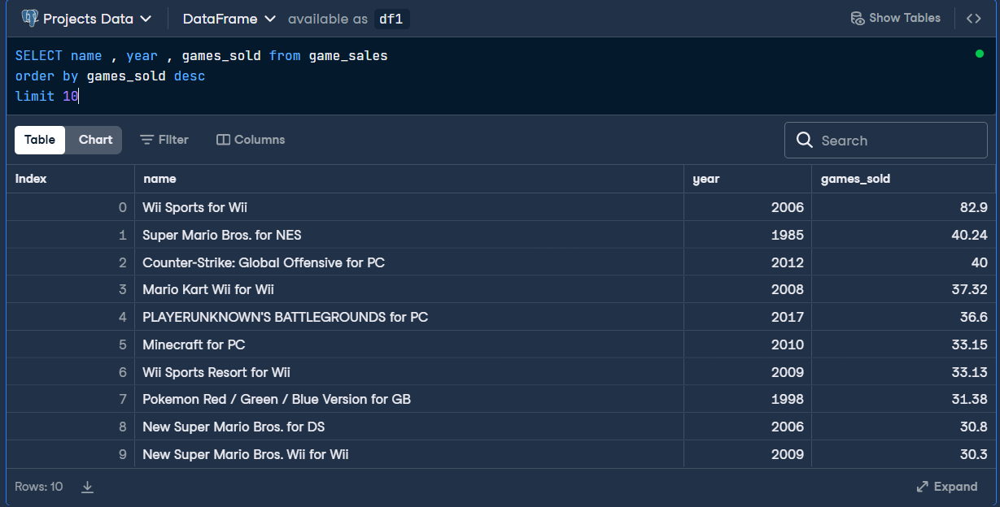
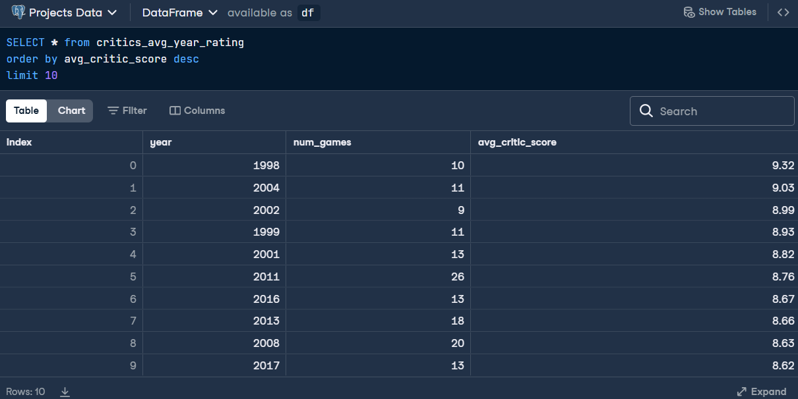
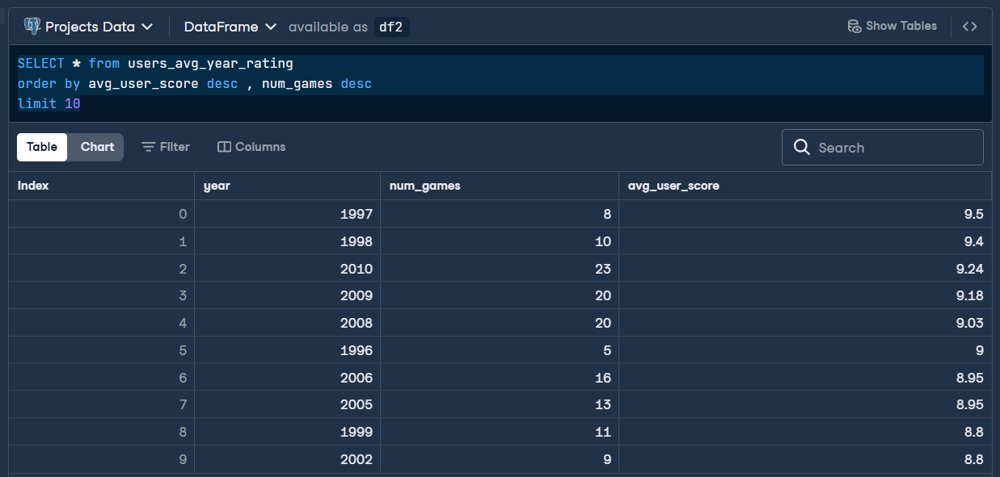
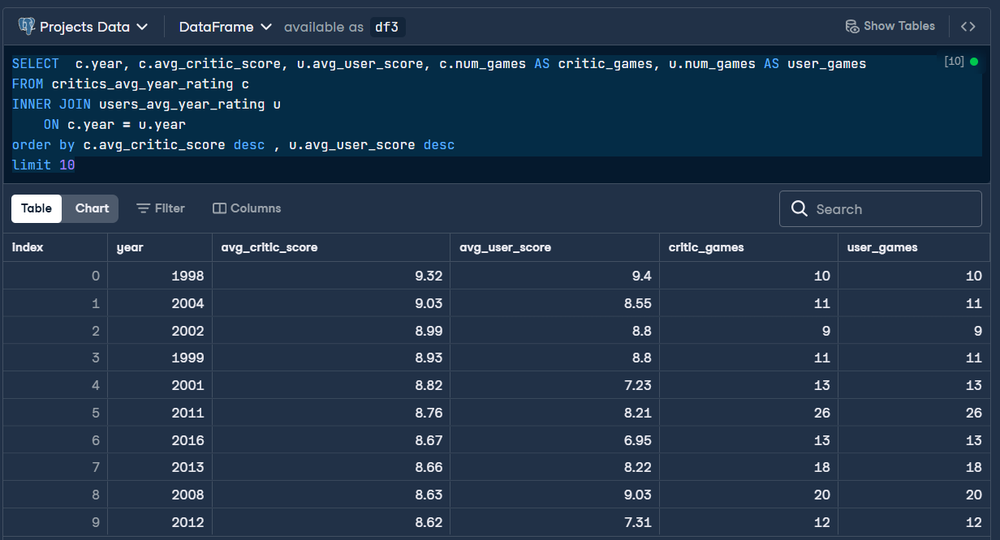
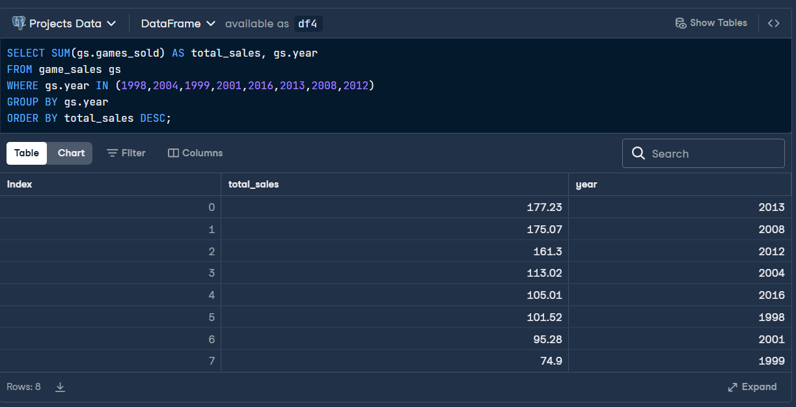

# 🎮 Análisis SQL: ¿Cuándo fue la Edad Dorada de los Videojuegos?

Este repositorio contiene un conjunto de consultas SQL utilizadas para explorar la evolución de los videojuegos en cuanto a calidad (según usuarios y críticos) y éxito comercial (ventas).

## 📁 Contenido

- `notebook.ipynb`: Archivo con todas las consultas SQL realizadas para analizar:
  - Juegos más vendidos
  - Años con mejores puntuaciones de críticos
  - Años mejor valorados por usuarios
  - Coincidencias entre ambos grupos
  - Ventas en años clave

## 🔗 Proyecto en DataCamp Datalab

Puedes ver y ejecutar el proyecto directamente aquí:  
[📊 Ver en DataCamp](https://www.datacamp.com/datalab/new?accountType=personal&_tag=workspace&workspaceId=c4c9dc46-f7fa-4bd2-97f0-ad06d80996a3&title=Project%3A%20When%20Was%20the%20Golden%20Era%20of%20Video%20Games%3F%20%28copy%29&utmContent=copy_duplicate_link&utmMedium=in_product&utmSource=workspace&viewMode=edit&visibility=public)

## 🧠 Preguntas que responde
¿Cuáles son los videojuegos más exitosos comercialmente?
 
 
¿Cuáles son los 10 años con mayor puntuación media de la crítica? 

¿Cuáles son los 10 años con mayor puntuación media de los usuarios y mayor número de visitas producidas?

¿Qué años tuvieron las puntuaciones medias más altas tanto de críticos como de jugadores y muchos éxitos producidos? 

¿Cuál es el número de juegos vendidos en esos años clave? 

## 💡 Objetivo

Identificar si existe una "Edad Dorada" de los videojuegos, donde la calidad crítica y popular coincide con el éxito de ventas.

## 🧰 Herramientas

- SQL
- Ejecutado en [DataCamp Datalab](https://www.datacamp.com/datalab)

## 🚀 Autor

**Diego Arroyo**  
📧 diegojulioarroyo@gmail.com  
🔗 [Mi LinkedIn](https://www.linkedin.com/in/diego-arroyo-b2153b229/) 
